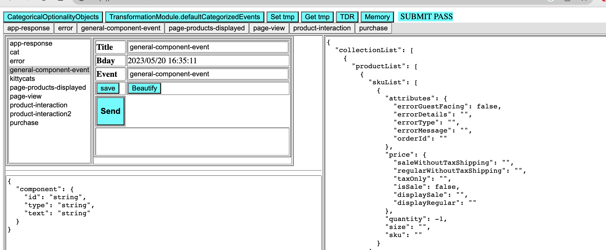
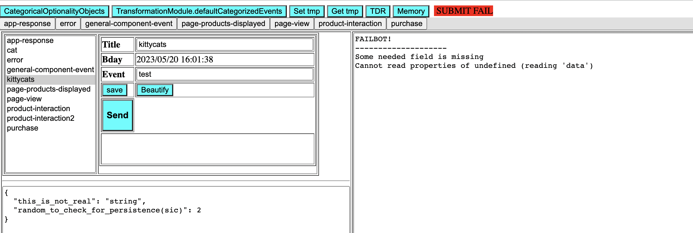
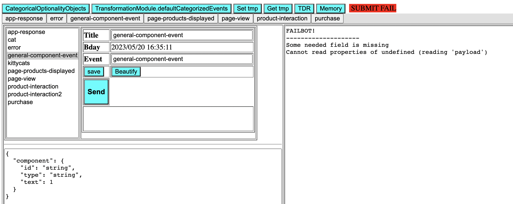
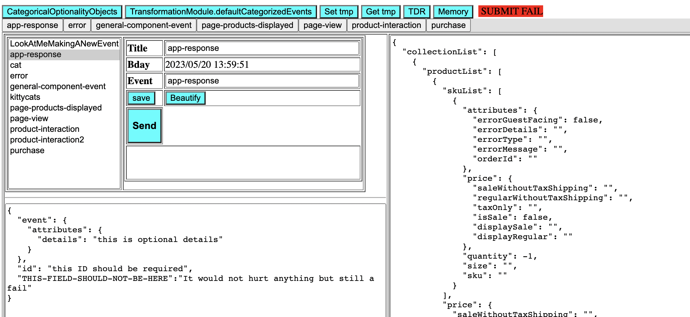
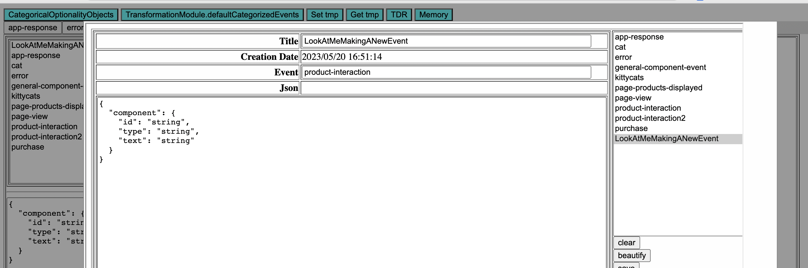

# A Facilitated TDR Creation mechanism!
Yay!

# repo
https://github.com/mulefish/stackblitz-webcontainer-api-starter-8bh3eh

# stackblitz-webcontainer-api-starter-8bh3eh
[Edit on StackBlitz ⚡️](https://stackblitz.com/edit/stackblitz-webcontainer-api-starter-8bh3eh)

# Running from localhost? 
- python -m http.server 3030 
- http://localhost:3030/

# How does this work?
- It uses LIVE MwaAnalytics.initializeAnalytics and self.validationModule data
- It has the concept of localstorage 
- While it has a mechanism to parse the information to create a TDR, after talking with Francis & Chanceler and, essentially, interviewing Shane I came to realize that 'facilitated process' would be better than a fragil automated one. This version can and does parse MwaAnalytics, but it will prefer localstorage.
- If something is IN MwaAnalytics but NOT in localstorage, it will be added. 
- If something is IN localstorage but different from how the MwaAnalytics is parsed? It will use the localstorage version
- It localstorage is fully CRUD. Hit the 'Memory' button to see the modal. 

# PASS / FAIL conditions
- Missing a needed field? Sadly, this is a PASS. Therefore 'facilitated process' good and '100% automated' is bad 
- Has a field but is the wrong type? Happy, this is a FAIL  
- Has an unneeded field? FAIL ( but I could tighten that up - TODO Confer with Shane )  
- JSON is ugly? Also a FAIL
- Making up a 'well formed' event and sending it? One that the back end does not expect? FAIL again
- Has fields and all the type are correct? This is a PASS!  

# Question
See comment and logic in 'defaultEvents.js' around the comment that starts with "// TODO! SEE HERE!!!" 
TL:DR: If a 'default has been zapped' put it back in. But if it has been changed then let it alone.  
Good idea or bad?

# Screen caps
Happy!

A kittycat event? Clearly that is a fail

Incorrect type is a fail

Incorrect type is a fail

CRUD in action!

# TODO
- There are two files which were created at different times. Many of the functions overlap in purpose. Code shrinkage woud be a good thing. 
- The OLD button row is still at the top of the page ie 'app-response', 'error' etc etc: I want to show Shane something and then I will remove those. 
